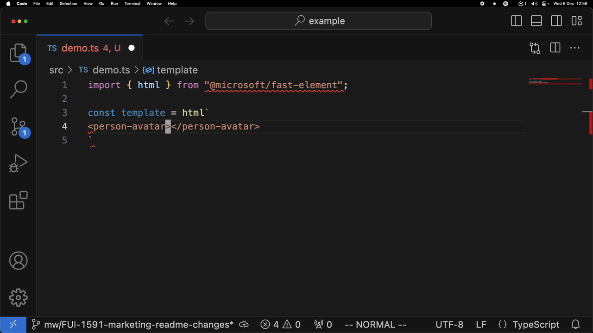
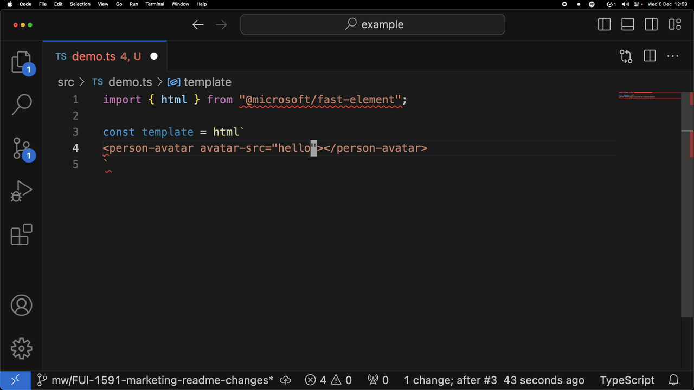

The [Genesis Global](https://genesis.global) Community Success initiative is committed to open-sourcing select technologies that we believe the open-source community would benefit from.

# Custom Elements Monorepo

This repository contains multiple packages which can be used to work with [Custom Elements](https://developer.mozilla.org/en-US/docs/Web/API/Web_components/Using_custom_elements).

| Editor | Completions | Diagnostics | Quickinfo | Info |
|---|---|---|---|---|
| VSCode | :white_check_mark: | :white_check_mark: | :white_check_mark: | Requires configuration to use local tsserver instance. |
| Vim/NeoVim | :white_check_mark: | :white_check_mark: | :white_check_mark: | Requires configuration as an LSP client for TypeScript. |
| JetBrains (IntelliJ/Webstorm/etc...) | :heavy_minus_sign: | :white_check_mark: | :x: | JetBrains IDEs [currently](https://youtrack.jetbrains.com/issue/WEB-62815/Ability-to-use-tsserver-to-implement-all-LSP-functionality-from-TypeScript) only have partial support as an LSP client. |

Any editor/IDE configured as an LSP client using the instance of tsserver which this plugin is installed to _should_ be compatible.

## Packages

### Custom Elements LSP Plugin
[](https://www.npmjs.com/package/@genesiscommunitysuccess/custom-elements-lsp) [](https://github.com/genesiscommunitysuccess/custom-elements-lsp/blob/master/LICENSE)

```shell
npm i @genesiscommunitysuccess/custom-elements-lsp --save-dev
```

The [CEP](./packages/core/custom-elements-lsp/README.md) is the primary package of the monorepo, and is a plugin for the TypeScript language server which adds in support for custom elements.

     

### CEP FAST Plugin

[](https://www.npmjs.com/package/@genesiscommunitysuccess/cep-fast-plugin) [](https://github.com/genesiscommunitysuccess/custom-elements-lsp/blob/master/LICENSE)

```shell
npm i @genesiscommunitysuccess/cep-fast-plugin --save-dev
```

The [FAST Plugin](./packages/core/cep-fast-plugin/README.md) for the CEP enables https://www.fast.design/ enhancements. Examples of this is using the `:prop` syntax for property bindings, and `?attr` syntax for boolean attributes.


   

### Analyzer Import Alias Plugin

[](https://www.npmjs.com/package/@genesiscommunitysuccess/analyzer-import-alias-plugin) [](https://github.com/genesiscommunitysuccess/custom-elements-lsp/blob/master/LICENSE)

```shell
npm i @genesiscommunitysuccess/analyzer-import-alias-plugin --save-dev
```

The [Analyzer Plugin](./packages/core/analyzer-import-alias-plugin/README.md) is a plugin for the [custom elements analyzer](https://custom-elements-manifest.open-wc.org/analyzer/getting-started/) which enhances its support for import aliases.

### Showcase Example

The private [showcase example](./packages/showcase/example/README.md) application is a test harness application built with TypeScript and MS Fast and is used to test out the Custom Elements Plugin (CEP) locally inside the monorepo.

### Showcase Example Library

The private [showcase example library](./packages/showcase/example-lib/README.md) is an example library of web components. It can be used as a test harness for testing the Custom Elements Plugin (CEP) to demonstrate that it works with library code, and it is imported into the showcase example app to demonstrate that the CEP works with imported code.

## Contributing

Thanks for taking interest in contributing to the Custom Elements Plugin. See [the contributing guidelines](./CONTRIBUTING.md).

## License

See [here](./LICENSE).
