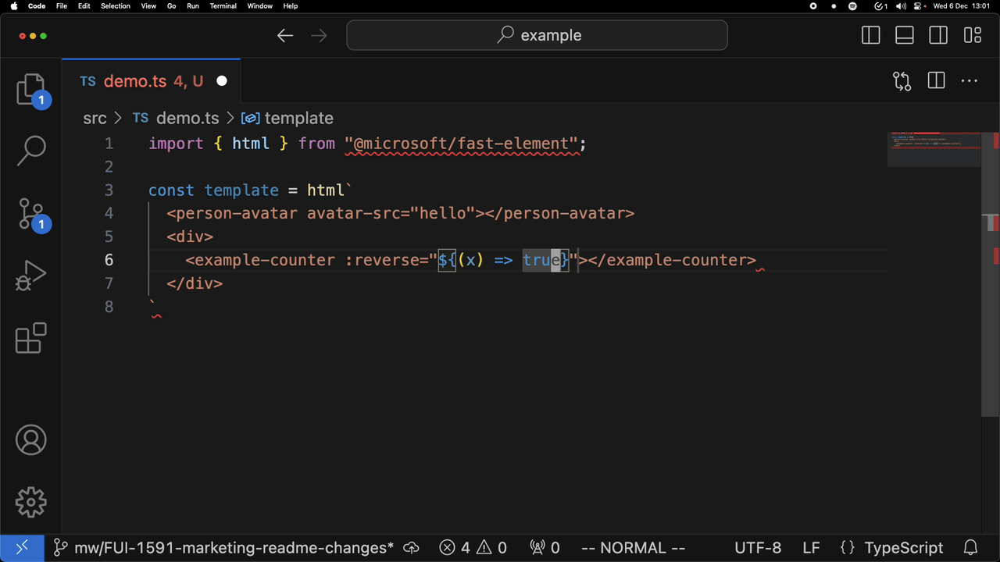
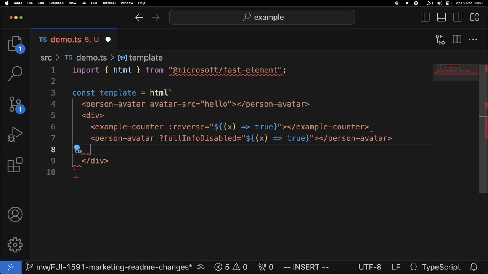
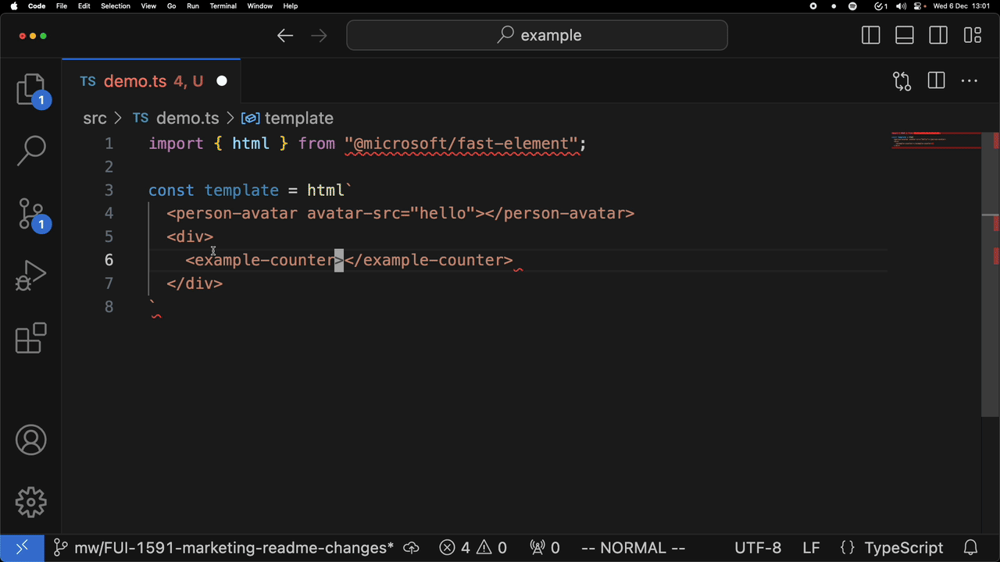

# Custom Elements Monorepo

This repository contains multiple packages which can be used to work with [Custom Elements](https://developer.mozilla.org/en-US/docs/Web/API/Web_components/Using_custom_elements).

To get started run `$ npm run bootstrap` in your shell.

## Packages

### Custom Elements LSP Plugin

 
The [CEP](./packages/core/custom-elements-lsp/README.md) is the primary package of the monorepo, and is a plugin for the TypeScript language server which adds in support for custom elements.

   

### CEP FAST Plugin

 
[Plugin](./packages/core/cep-fast-plugin/README.md) for the CEP which enables https://www.fast.design/ enhancements. Examples of this is using the `:prop` syntax for property bindings, and `?attr` syntax for boolean attributes.

   

### Analyzer Import Alias Plugin

The [Analyzer Plugin](./packages/core/analyzer-import-alias-plugin/README.md) is a plugin for the [custom elements analyzer](https://custom-elements-manifest.open-wc.org/analyzer/getting-started/) which enhances its support for import aliases.

 

### Showcase Example

The private [showcase example](./packages/showcase/example/README.md) application is a test harness application built with TypeScript and MS Fast and is used to test out the Custom Elements Plugin (CEP) locally inside the monorepo.

### Showcase Example Library

The private [showcase example library](./packages/showcase/example-lib/README.md) is an example library of web components. It can be used as a test harness for testing the Custom Elements Plugin (CEP) to demonstrate that it works with library code, and it is imported into the showcase example app to demonstrate that the CEP works with imported code.

## Contributing

Thanks for taking interest in contributing to the Custom Elements Plugin. See [the contributing guidelines](./CONTRIBUTING.md).

## License

See [here](./LICENSE).
