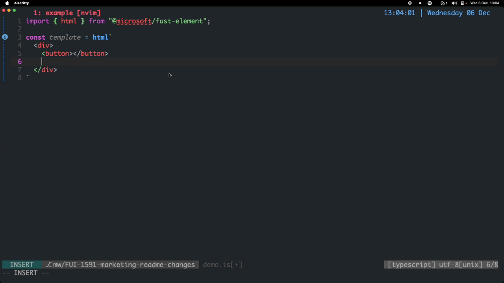

The [Genesis Global](https://genesis.global) Community Success initiative is committed to open-sourcing select technologies that we believe the open-source community would benefit from.

[](https://www.npmjs.com/package/@genesiscommunitysuccess/custom-elements-lsp) [](https://github.com/genesiscommunitysuccess/custom-elements-lsp/blob/master/LICENSE)

# Custom Elements LSP Plugin

Install this TypeScript plugin in your project to enhance your LSP enabled editor with IntelliSense handling for [web component custom elements](https://developer.mozilla.org/en-US/docs/Web/API/Web_components/Using_custom_elements). This includes: autocompletion, diagonstics, and jump to definition.

| Editor | Completions | Diagnostics | Quickinfo | Info |
|---|---|---|---|---|
| VSCode | :white_check_mark: | :white_check_mark: | :white_check_mark: | Requires configuration to use local tsserver instance. [Setup](#vscode) |
| Vim/NeoVim | :white_check_mark: | :white_check_mark: | :white_check_mark: | Requires configuration as an LSP client for TypeScript. [Setup](#nvim) |
| JetBrains (IntelliJ/Webstorm/etc...) | :heavy_minus_sign: | :white_check_mark: | :x: | JetBrains IDEs [currently](https://youtrack.jetbrains.com/issue/WEB-62815/Ability-to-use-tsserver-to-implement-all-LSP-functionality-from-TypeScript) only have partial support as an LSP client. [Setup](#jetbrains) |

**A simple setup in your project should not take long.** Follow along with a video [here](https://www.loom.com/share/3dfdb245cbfc4fc1a166df8b19c123a5?sid=c478ca86-f0ba-4cfe-af9d-7ee6d30e26c6) and look at [this example project](https://github.com/genesiscommunitysuccess/cep-setup-example) and see the [changeset required to enable the LSP](https://github.com/genesiscommunitysuccess/cep-setup-example/pull/2/files).

Any editor/IDE configured as an LSP client using the instance of tsserver which this plugin is installed to _should_ be compatible.


<details>
    <summary>Show more examples</summary>
    <br>
    
    
    
</details>

Quicklook information is also provided, as well as IntelliSense for standard HTML elements. As previously stated, you can use any LSP enabled editor, such as Vim/NeoVim with LSP plugins for example.


<details>
    <summary>Show more examples</summary>
    <br>
    
    
</details>

There is an additional [companion plugin](https://www.npmjs.com/package/@genesiscommunitysuccess/cep-fast-plugin) which enables functionality when working with [FAST](https://www.fast.design/).



> Follow the readme of the [linked plugin](https://www.npmjs.com/package/@genesiscommunitysuccess/cep-fast-plugin) to set that up too if required.

## Plugin Setup and Usage

These instructions are for setting up the LSP in your application. If you are wanting to set up the LSP test it or contribute to it then go to [this section](#plugin-development).
To use this plugin you have a version of typescript as part of the project, located inside of the `node_modules`.

1. Install this package as a dev dependency in the target project.

```shell
npm i @genesiscommunitysuccess/custom-elements-lsp --save-dev
```

2. Configure the plugin in the `tsconfig.json`. The following is an example shape, see below for full explanations.

```json
{
  "compilerOptions": {
    "plugins": [
      {
        "name": "@genesiscommunitysuccess/custom-elements-lsp",
        "srcRouteFromTSServer": "configure this to set the relative path between your project route and your `tsserver.js`",
        "designSystemPrefix": "configure this to handle a library of components with a prefix",
        "parser": {
          "timeout": 2000,
          "src": "configure this to define the source code to parse",
          "dependencies": [
            "configure these globs to find manifest files from your dependencies",
            "and use the ! pattern to ignore manifests"
          ]
        },
        "plugins": ["set plugins here!"]
      }
    ]
  }
}
```
> See [here](#example-config) for an example.
3. You need to use a target of `ES2015` or later in your `tsconfig.json`.

Base options.

| Option                | Optional and Default | Explanation                                                                                                                                                                                                                                                                  |
|---|---|--|
| `name`                | False                | Need to set as `@genesiscommunitysuccess/custom-elements-lsp` to enable this plugin.                                                                                                                                                                                         |
| `srcRootFromTSServer` | True (`"../../../"`)   | `srcRouteFromTSServer` is the relative path from the `tsserver.js` executable in your node modules, to your directory with the `package.json` where the project web root is located. This is likely to be `node_modules/typescript/lib/tsserver.js` hence we use `../../..`. *WARNING:* If you are using a monorepo pattern with workspaces, you must account for potential hoisting of the TypeScript library in the `node_modules` to a parent directory.|
| `designSystemPrefix`  | True (N/A)           | Used to work with `%%prefix%%` to handle components registered as part of a design system. See [here](#advanced-usage).                                                                                                                                                      |
| `plugins`  | True (`[]`)           | Set of optional plugins you can add to the CEP to enhance its functionality. Specified plugins are applied in order. |


Parser options. These control the analysis of the source code to understand semantics such as whether a custom element has a property or not. This is not controlling the LSP working with the html in the templates to understand whether there are diagnostic issues, or to aid with completion suggestions.

| Option | Optional and Default | Explanation |
|---|---|---|
| `src` | True (`"src/**/*.{js,ts}"`) | The glob of the source files in the current project to analyze live.  |
| `timeout` | True (2000) | Time in milliseconds to debounce calls between running the analyzer on the source files. The lower the time the more responsive the LSP will be to changes in the source code but the more resources it will use. |
| `dependencies` | True (`[]`) | An array of strings of globs that find `custom-elements.json` from library dependencies to use with the LSP. Libraries will ship production code with which the analyzer will not be able to parse, so the libraries need to ship the manifest generated [from the analyzer](https://custom-elements-manifest.open-wc.org/analyzer/config/). An example default you could use to load all files would be `["node_modules/**/custom-elements.json","!**/@custom-elements-manifest/**/*"]` which will find all of the manifests in your dependencies, but ignore the test manifests from the analzyer dependency itself.
| `fastEnable`          | True (disabled)      | Enables Microsoft FAST parsing of local components. You need to enable the plugin too for full functionality |

Only the `src` files are watched for changes to update the analyzer, if you update the dependencies containing manifest files you must restart the LSP for it to be aware of the changes.

*WARNING:* If you are using a monorepo pattern with workspaces, you must account for potential hoisting of the TypeScript library in the `node_modules` to a parent directory. The path of `src` and `dependencies` will be relative to the path created from the typescript install location and the `srcRouteFromTSServer` config option.

### Example Config

```json
{
  "compilerOptions": {
    "plugins": [
      {
        "name": "@genesiscommunitysuccess/custom-elements-lsp",
        "srcRouteFromTSServer": "../../..",
        "designSystemPrefix": "example",
        "parser": {
          "fastEnable": true,
          "timeout": 2000,
          "dependencies": [
            "node_modules/example-lib/**/custom-elements.json",
            "!**/@custom-elements-manifest/**/*"
          ]
        },
        "plugins": ["@genesiscommunitysuccess/cep-fast-plugin"]
      }
    ]
  }
}
```

The above configuration would set the following:
* Enable the plugin.
* Set `example` as the design system, so any component prefix like that would be of the pattern `example-X`, such as `example-button`.
* Set up the [FAST plugin](https://www.npmjs.com/package/@genesiscommunitysuccess/cep-fast-plugin) by enabling parsing of the syntax, and the plugin itself in the `plugins` array.
* Use the default path for the source code parsing, find all manifests from the `example-lib` dependency, and ignore the manifests from `@custom-elements-manifest` directory.

### FAST Syntax

There is current support for enhanced FAST handing (syntax such as `@event` on the template definitions). To enable this you'll need perform the following steps:
1. Enable enhanced completions and diagnostics by setting the `"fastEnable": true` parser option in your `tsconfig.json`.
2. Install the `@genesiscommunitysuccess/cep-fast-plugin` to your project with your package manager.
3. Add the package from step 2 in your `plugins` array in your main config block in your `tsconfig.json`. See the example at the top of the page.

### VSCode

You just need to setup VSCode to use your local typescript install as by default it will try and use a version of typescript it is bundled with.
1. Create a directory `.vscode` in the root of the monorepo. Inside of that create a file called `settings.json`. Then fill it with the following contents:
```json
{
  "typescript.tsdk": "node_modules/typescript/lib"
}
```
You can see an example of this in this repository - `./example/.vscode/settings.json`.
> If you already have that file and directory because you've created your own project config, then you can simply add the key/value pair from the json block into your existing config.

> Advanced: If npm has hoisted your typescript install, ensure the path you configure accounts for that (ensure `typescript.tdsk` points to the `lib` directory of the project typescript install).

2. Launch VSCode on the root directory of the monorepo (so in the folder structure you'll have `.vscode` directory from step 1 at the root). You can do this via the GUI or if you've installed VSCode on your path you can navigate to the root and run `code .`.

3. Ensuring you have a typescript file open, open the command palette (Ctrl/Cmd + Shift + P) and search for `TypeScript: Select Typescript Version...`

> If you don't see this option then ensure you have a `.ts` file open.

4. Select the workspace version, which should have the path matching the path set in the value of step 1.

> If you don't see this option then ensure that you've opened the project in VSCode that has the `.vscode` directory from step 1 at the root.

5. That should be it! Please note that you'll not see any diagnostics information after the LSP had loaded until you interact and change the file.

### NVIM

If you have an LSP setup for typescript this should work straight away using the project's TypeScript. There are lots of different ways you can configure NeoVim/Vim as an LSP client, configuring that is out of the scope of these instructions.

### JetBrains

This section covers all of JetBrains IDEs, such as WebStorm and IntelliJ.
[Currently](https://youtrack.jetbrains.com/issue/WEB-62815/Ability-to-use-tsserver-to-implement-all-LSP-functionality-from-TypeScript) there is only partial support for the CEP.
* Full diagnostics support.
* Partial completions support, provided by the IDE itself *not* using the CEP - but enhanced because of the manifest files that are used with the plugin.
* No support for quicklook/quickinfo, as JetBrains run this closed source without using `tsserver` in their IDEs.

To use the LSP in your JetBrains IDE.
1. Launch the IDE with the project at the root of the monorepo.
2. Open the preferences menu option from the settings.

3. Navigate to the `Typescript` settings in the `Languages & Frameworks` settings, and ensure that the typescript option is set to the `node_modules/typescript` of your _local_ project, as shown in the image. This may be the default already, in which case you don't need to do anything. You'll also want to enable at least the three options which are enabled in the image below.

4. That should be it! Please note that you'll not see any diagnostics information after the LSP had loaded until you interact and change the file.

> Please note the location and appearance of menus may differ between IDEs and versions.

### Advanced Usage

`designSystemPrefix` is used to specify how to handle custom elements which are defined but exported as an element registry function, and later registered against a design system with a specific prefix. An example of this is [FAST component libraries](https://www.fast.design/docs/design-systems/creating-a-component-library). Export these with the magic string `%%prefix%%-` at the start of the tagname and then `designSystemPrefix` will override the `%%prefix%%`.

In the config of this repository it is set to `example` because we use the `example` prefix as set in `./example/src/components.ts`. An example of a component exported in this way can be found in the `./example/src/components/button/` directory.

### Troubleshooting

#### Analyzer Script

If the results of the LSP are not what you're expecting (e.g. incorrect or missing information) then it may be because the source and dependencies paths have an issue, and the plugin is not able to correctly find the files to parse.

You can generate a copy of the manifest file that the plugin is using by running the analyzer executable script which is provided with this plugin with the `custom-elements-analyze` command.

1. Set up a npm script in your `package.json` to execute the command. For example:

```json
{
  "scripts": {
    "lsp:analyze": "custom-elements-analyze --tsconfig=./src/tsconfig.json",
  },
}
```

The script currently takes an optional argument:
- `--tsconfig` - the path to the tsconfig.json file to use. Defaults to `process.cwd()`.
- `--fastEnable` is set from the plugin config.

This `package.json` needs to be the same location on the file system that the `srcRouteFromTSServer` relative path gets you to, as explained in [the setup section](#plugin-setup-and-usage).

2. Run the npm script you just created with `npm run lsp:analyze`.
3. Check `ce.json` to see what components have issues, or are missing from the manifest.
4. If there are any issues then you can change the glob patterns and repeat from step 1 until you're happy.
5. Once you are receiving the correct output from the script you can update your `tsconfig.json` to fix the issue in the LSP plugin.

##### Analyzer Script Extra

If you are still running into issues then you can spend time verifying that the debugging analyzer script is getting the same view as the CEP itself.
1. Complete the `Setup Logging` section from the [contributing](./CONTRIBUTING.md) document.
2. Run the CEP in your IDE and check the logs for a line that looks roughly like `Info 32   [14:43:25.686] [CE] Analyzing and updating manifest. Config: ...`
3. Run the analyzer script and see the same line like `[log] Analyzing and updating manifest. Config: ...`
4. Verify they're the same. If not then there is potentially something wrong with your plugin setup.

## Contributing

Thanks for taking interest in contributing to the Custom Elements Plugin. See the contributing guidelines (`CONTRIBUTING.md`) at the root of the monorepo.

## License

See [here](./LICENSE).
